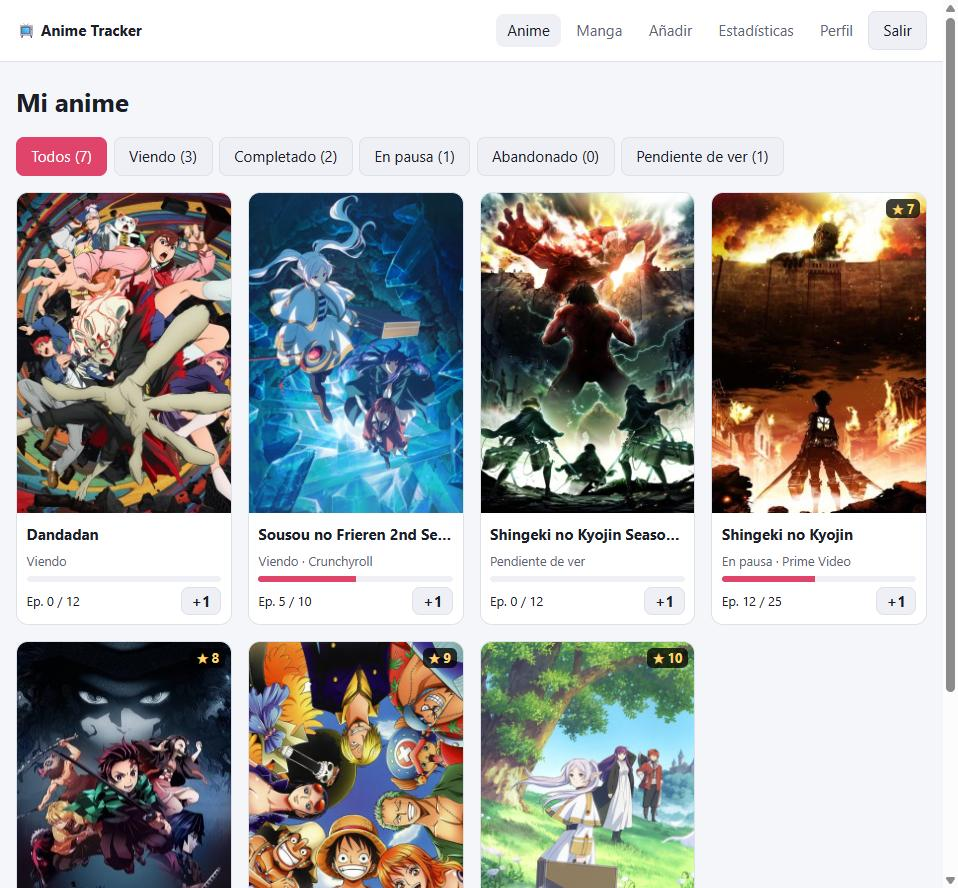
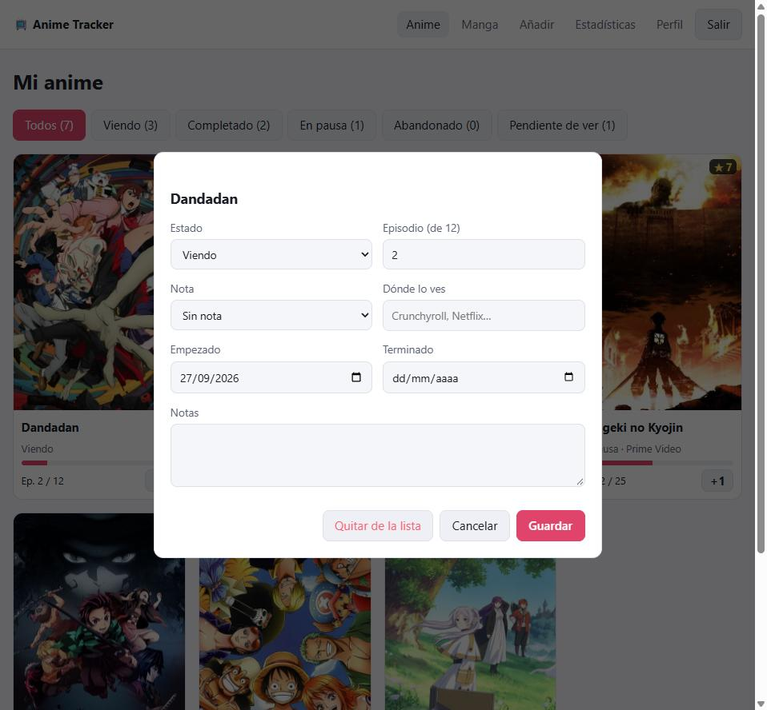
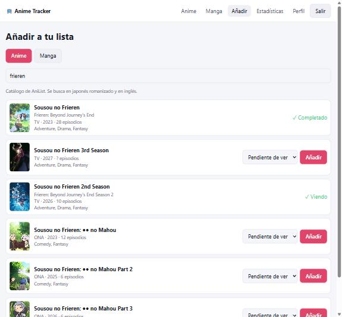
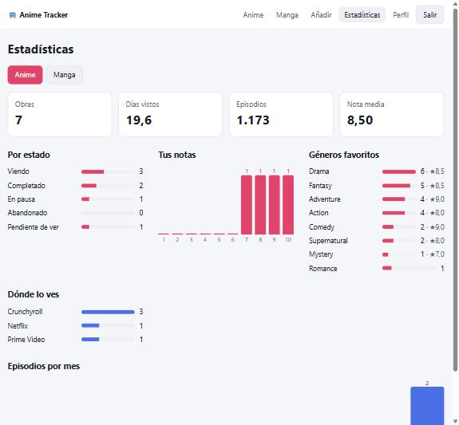

# Anime Tracker · ASP.NET Core 10 + Angular 22 + PostgreSQL

[](https://github.com/jimmyrom1/anime-tracker/actions/workflows/ci.yml)

Tu lista de anime y manga, al estilo MyAnimeList. En cada obra apuntas:

- por qué episodio o capítulo vas;
- la nota que le das, del 1 al 10;
- dónde la ves o la lees (Crunchyroll, Netflix, Manga Plus, tomo físico…).

Además calcula tus estadísticas: días vistos, nota media, géneros favoritos, plataformas y
actividad por meses. Si quieres, puedes compartir tu lista con un perfil público.

El catálogo (portadas, número de episodios, géneros, duración) viene de la
[API pública de AniList](https://docs.anilist.co), sin API key.



| Editar una entrada | Buscar y añadir | Estadísticas |
| --- | --- | --- |
|  |  |  |

## Stack

| Capa | Tecnología |
| --- | --- |
| API | ASP.NET Core 10 (minimal APIs), Identity con tokens *bearer*, ProblemDetails, OpenAPI + Scalar (`/docs`) |
| Dominio | Proyecto C# sin dependencias: reglas de la lista y cálculo de estadísticas |
| Datos | PostgreSQL 16 con Entity Framework Core 10 (Npgsql), migraciones, `xmin` para concurrencia optimista |
| Catálogo | AniList GraphQL con `HttpClient` tipado, resiliencia (`Microsoft.Extensions.Http.Resilience`) y `SlidingWindowRateLimiter` |
| Frontend | Angular 22 *zoneless* con *signals*, componentes standalone, carga diferida por ruta |
| Calidad | 33 tests xUnit (dominio + API completa contra PostgreSQL real con `WebApplicationFactory`), 6 tests Vitest |
| Infraestructura | Docker Compose (PostgreSQL + API + Nginx), GitHub Actions |

## Arrancar

```bash
docker compose up --build
```

Abre <http://localhost:8080>, crea una cuenta y busca tu primer anime.

Sin Docker necesitas el SDK de .NET 10, Node 24 y un PostgreSQL:

```bash
cd backend
dotnet run --project src/AnimeTracker.Api    # aplica las migraciones al arrancar
cd ../frontend
npm install && npx ng serve                  # http://localhost:4200 (proxy de /api a la API)
```

La cadena de conexión está en `appsettings.json`; en desarrollo, en `appsettings.Development.json`.

## Qué hace por ti

Las reglas de la lista viven en [`ListEntry.cs`](backend/src/AnimeTracker.Domain/ListEntry.cs),
una clase de dominio que se testea sin base de datos:

- **Ver el primer episodio de algo pendiente lo pasa a "Viendo"** y apunta la fecha de inicio.
- **Llegar al último episodio lo marca como completado**, con fecha de fin.
- **No puedes pasarte del total** ni bajar de 0. Si la serie está en emisión y AniList aún no sabe
  cuántos episodios tendrá (One Piece), no hay tope.
- **Marcarlo como completado a mano rellena el progreso** con el total.
- **Retomar algo en pausa o abandonado**: basta con avanzar un episodio.
- **Volver a verla es una acción aparte.** Bajar el progreso de algo completado puede ser corregir
  un error, y eso no debe contar como una vez más.
- **Nota de 1 a 10**, plataforma con sugerencias según sea anime o manga, notas personales y fechas
  coherentes (no futuras, el fin no antes del inicio).

## Decisiones técnicas

### El botón +1 nunca pierde un episodio

Si pulsas "+1" en el móvil y en el ordenador a la vez, o haces doble toque, las dos peticiones
leen `progress = 4` y las dos escriben 5. Se ha perdido un episodio. Por eso:

- La entrada usa la columna de sistema `xmin` de PostgreSQL como **token de concurrencia
  optimista** (`IsRowVersion()` en EF Core). El segundo `UPDATE` no encuentra la versión que leyó
  y falla.
- [`ListService.IncrementAsync`](backend/src/AnimeTracker.Api/Lists/ListService.cs) captura ese
  conflicto, recarga la entrada y vuelve a aplicar el +1 (hasta 5 intentos).
- Un test lanza **10 "+1" simultáneos** y comprueba que el progreso queda en 10 y que la actividad
  del mes suma 10.
- En la interfaz, el botón se desactiva mientras la petición está en curso.

### Las reglas también en la base de datos

La API valida, pero PostgreSQL tiene la última palabra:

- `CHECK (Score BETWEEN 1 AND 10)`, `CHECK (Progress >= 0)` y fechas coherentes.
- **Índice único `(UserId, MediaId)`**: una obra no puede estar dos veces en tu lista. Un test lanza
  cinco "añadir" simultáneos y comprueba que pasa uno y los otros cuatro reciben `409`.
- Nombre de perfil en minúsculas con `CHECK` por expresión regular y único.

### Catálogo de AniList: pedir lo mínimo y aguantar sus caídas

- Cada ficha se guarda en PostgreSQL con el **id de AniList como clave**. Una obra que añaden mil
  usuarios se descarga una vez, y tu lista se sirve sin llamar a AniList.
- Las búsquedas se cachean 10 minutos en memoria, porque se repiten mucho mientras se escribe. En
  el frontend hay además *debounce* de 350 ms y `switchMap`, así que una respuesta antigua no pisa
  a la nueva.
- Las series **en emisión** se refrescan cada 12 horas, porque ganan episodios. Las terminadas no se
  vuelven a pedir.
- AniList admite 90 peticiones por minuto, rebajadas ahora a 30. Se usan 25 con un
  `SlidingWindowRateLimiter` compartido por toda la API; si se llena, las peticiones esperan en
  cola.
- Reintentos con espera exponencial, *timeout* y *circuit breaker* con
  `AddStandardResilienceHandler()`.
- **Si AniList se cae y la ficha ya está guardada, se sirve la copia.** Si no hay copia, la API
  responde `503` con `Retry-After`. Los dos casos tienen test.

### Estadísticas como función pura

[`StatsCalculator`](backend/src/AnimeTracker.Domain/ListStats.cs) recibe las entradas y los
eventos de progreso y devuelve lo siguiente:

- **días vistos** (episodios × duración, como el "Days" de MyAnimeList);
- nota media y distribución del 1 al 10;
- géneros favoritos con su nota media;
- plataformas (sin distinguir mayúsculas: "crunchyroll" y "Crunchyroll" son la misma);
- actividad de los últimos 12 meses, incluidos los meses vacíos para que la gráfica no se los salte.

Cada avance de progreso se guarda como evento **en la misma transacción** que la entrada. Si
fallara uno, fallarían los dos.

Probando la app salió un fallo de concepto: al añadir una serie como "Completada", todos sus
episodios contaban como actividad de este mes. Quien metiera su historial de 50 animes vistos
tendría una gráfica absurda. Ahora **añadir es catalogar y no cuenta; solo cuenta el progreso**.
Tiene su test.

### "Hoy" es hoy en España, no en el servidor

Las fechas de inicio y fin se calculan en la zona horaria de la app (`App:TimeZone`, por defecto
`Europe/Madrid`). Un episodio visto a las 00:30 en España es de ese día aunque el servidor vaya en
UTC. El reloj es un `TimeProvider` inyectado, y los tests lo mueven.

Los tests destaparon además que **el token de sesión caduca según ese mismo reloj**: al adelantarlo
13 horas para simular una serie en emisión, la sesión ya no valía. Es el comportamiento correcto, y
los tests vuelven a iniciar sesión.

### Perfil público sin filtrar nada privado

- `/u/{nombre}` muestra tu lista y tus estadísticas **solo si lo activas**. Si no existe o no es
  público, responde `404` en los dos casos, para no revelar qué nombres existen.
- Las **notas personales nunca salen** en el perfil público.
- Una entrada de otro usuario da `404` y no `403`, por el mismo motivo.

### Un fallo de interfaz que solo se ve usándola

Al pulsar "+1", la tarjeta subía al principio de la lista por ser la última actualizada. Lo que
quedaba bajo el cursor era el "+1" de otra serie, así que un doble toque sumaba un episodio a la
que no era. Ahora la tarjeta se actualiza en su sitio, y el orden por última actualización se
aplica al recargar. Hay un test de componente que lo comprueba.

## API

La documentación interactiva está en `/docs` (Scalar) y el OpenAPI en `/openapi/v1.json`.

| Método | Ruta | Descripción |
| --- | --- | --- |
| `POST` | `/api/auth/register` · `/api/auth/login` | Cuenta y token (ASP.NET Core Identity) |
| `GET` · `PUT` | `/api/me` · `/api/me/profile` | Tu cuenta; nombre público y visibilidad |
| `GET` | `/api/catalog/search?type=Anime&q=` | Buscar en AniList (marca lo que ya tienes) |
| `GET` · `POST` | `/api/list?type=Anime[&status=]` · `/api/list` | Tu lista · añadir una obra |
| `PUT` · `DELETE` | `/api/list/{id}` | Editar (estado, progreso, nota, plataforma, notas, fechas) · quitar |
| `POST` | `/api/list/{id}/increment` · `/api/list/{id}/rewatch` | +1 episodio o capítulo · volver a verla |
| `GET` | `/api/stats?type=Anime` | Tus estadísticas |
| `GET` | `/api/profiles/{nombre}?type=Anime` | Perfil público (sin sesión) |

Los errores siguen el formato ProblemDetails:

- `422` indica en `errors` el campo que falla y en `code` el motivo (p. ej. `out_of_range`).
- `404` si la obra o la entrada no existe.
- `409` si hay un conflicto (ya está en tu lista, nombre cogido).
- `503` si AniList no está disponible.

## Tests

```bash
cd backend && dotnet test          # usa TEST_DATABASE_URL (en la CI, un servicio de PostgreSQL)
cd frontend && npx ng test --watch=false
```

| Suite | Qué cubre |
| --- | --- |
| Dominio (17) | Transiciones de estado, límites del progreso, volver a ver, notas, plataforma, fechas; días vistos, nota media, géneros, plataformas y actividad |
| API (16) | La app entera con `WebApplicationFactory` contra PostgreSQL real, AniList simulado y reloj controlado (detalle abajo) |
| Angular (6) | Lista (progreso, +1 sin mover la tarjeta, error del servidor en pantalla), textos por tipo y mensajes de error de ProblemDetails |

Los tests de la API cubren:

- la caché del catálogo y la copia guardada si AniList se cae;
- "añadir" simultáneos y "+1" simultáneos;
- el aislamiento entre usuarios;
- la zona horaria;
- el perfil público;
- que añadir tu historial no cuenta como actividad.

La CI ejecuta:

1. **.NET:** build con *warnings* como errores, tests contra PostgreSQL y comprobación de que no
   falta ninguna migración (`dotnet ef migrations has-pending-model-changes`).
2. **Angular:** tests y build.
3. **Docker:** levanta el stack completo y, a través de Nginx, prueba el registro, el login y una
   búsqueda en el AniList real.

## Qué añadiría después

- Importar tu lista de MyAnimeList o AniList (exportación XML de MAL).
- Aviso cuando sale un episodio nuevo de algo que estás viendo (AniList da el calendario de emisión).
- Refresh tokens y sesión en cookie `HttpOnly` en lugar de `localStorage`.
- Listas personalizadas ("favoritos", "para ver con amigos") y etiquetas.

## Otros proyectos

Forma parte de una serie de proyectos con el mismo enfoque: reglas de negocio garantizadas
por la base de datos o por funciones puras, tests que prueban los casos difíciles y CI en cada push.

| Proyecto | Qué es |
| --- | --- |
| [LoL Tracker](https://github.com/jimmyrom1/lol-tracker) | App Android nativa: Kotlin, Jetpack Compose, Room, Hilt, detalle de partidas y asistente de draft. |
| [LoL Tracker API](https://github.com/jimmyrom1/lol-tracker-api) | Backend en Node.js 24 + TypeScript + Fastify: proxy de la API de Riot con caché compartida y límite de peticiones. |
| [Subscriptions API](https://github.com/jimmyrom1/subscriptions-api) | API REST con Java 21 y Spring Boot 4: prorrateo, facturación idempotente, ShedLock, Flyway y Testcontainers. |
| [Reserva de salas](https://github.com/jimmyrom1/room-booking) | Flask + PostgreSQL + React: reservas sin solapes garantizadas por un `EXCLUDE` de PostgreSQL, JWT y exportación a calendario. |
| [Mini Facturas](https://github.com/jimmyrom1/mini-invoice-generator) | Flask + PostgreSQL + React: facturas con IVA por línea, IRPF, numeración correlativa atómica y PDF. |

## Licencia

MIT. Los datos del catálogo son de [AniList](https://anilist.co); este proyecto no está afiliado a
AniList ni a MyAnimeList.
